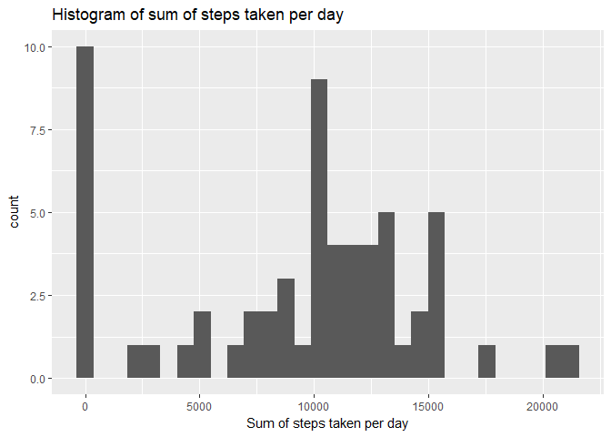
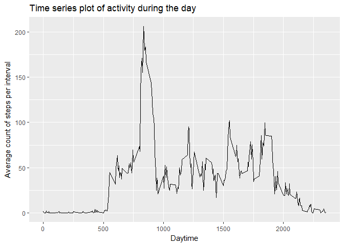
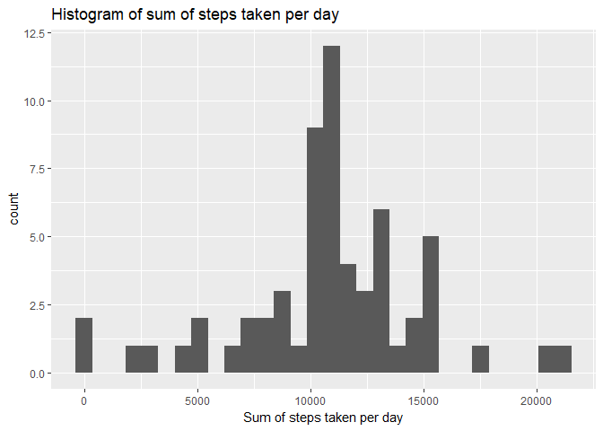
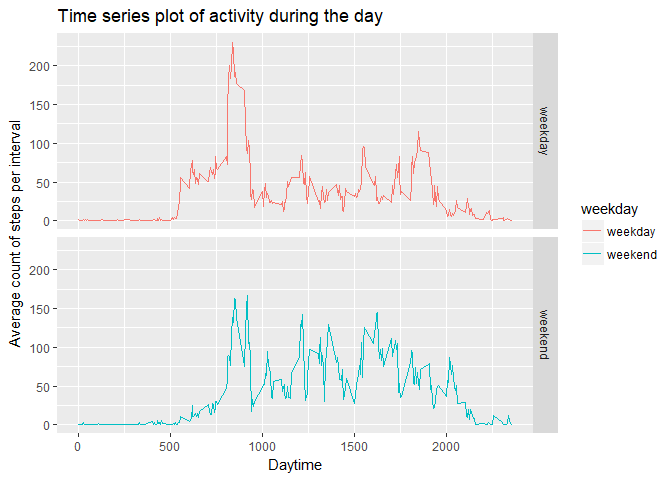

## Loading and preprocessing the data
First of all we read in the data from a given zip-file. The following variables are include in the dataset.  
- steps: Number of steps taking in a 5-minute interval (missing values are coded as NA)  
- date: The date on which the measurement was taken in YYYY-MM-DD format  
- interval: Identifier for the 5-minute interval in which measurement was taken  

We also convert the values of the date column from character to a date-object. This is helpful to differentiate between weekdays and weekend in a later part of the analysis.  
  


```r
library(dplyr)
library(ggplot2)

# Unzip and read activity-data
data<-read.csv(unzip("activity.zip"))

# Convert date column into data class
data<-data%>%mutate(date=as.Date(date, "%Y-%m-%d") )
```


## What is mean total number of steps taken per day?
To gain some insights of the activity behavior of the observed subject, we calculate the sum of all steps taken per day. In the first approach we remove all observations with missing steps-value. 
  


```r
# Calculating the total steps taken grouped by date (NAs are removed)
steps_date<-data%>%group_by(date)%>%summarize(sum=sum(steps,na.rm = TRUE))
```

To get an grapical overview, we create a histogram of the "steps taken per day"-value.  
In this analysis we see that there is a peak near 10,000 steps. It seams, that there are also 10 days without any taken step.  
  

```r
# Draw a histogramm of the sum of steps per day
g<-ggplot(data = steps_date, aes(steps_date$sum))
g + geom_histogram() +
    labs(x="Sum of steps taken per day") +
    labs(title="Histogram of sum of steps taken per day")
```

<!-- -->

  
Now we calculate the mean and the median of the steps taken per day. With these values we can see if there is a negativ skew (mean less than median) in the distribution, that **can** indicate a bias in the data.  
  

```r
# Calculate mean of the sum of steps per day 
mean(steps_date$sum)
```

```
## [1] 9354.23
```

```r
# Calculate median of the sum of steps per day 
median(steps_date$sum)
```

```
## [1] 10395
```


## What is the average daily activity pattern?
Next we want to take a look on the activity behavior during the whole day. Doing this, we calculate the average number of steps taken grouped by every interval.


```r
# Calculating the average steps taken grouped by interval (NAs are removed)
steps_interval<-data%>%group_by(interval)%>%summarize(mean=mean(steps,na.rm = TRUE))
```

To get an graphical overview, we draw a time series plot of the data. Especially we can see a difference day and night time.  


```r
# Draw a time series plot of the average taken steps over every interval of the day
g<-ggplot(data = steps_interval, aes(x=steps_interval$interval, y=steps_interval$mean))
g + geom_line() +
    labs(x="Daytime") +
    labs(y="Average count of steps per interval") +
    labs(title="Time series plot of activity during the day")
```

<!-- -->

  
The plot shows a high peak in the morning. Lets calculate the maximum average count of steps and the corresponding interval.  


```r
# Identify the maximum value of the ploted data
steps_interval$mean[which.max(steps_interval$mean)]
```

```
## [1] 206.1698
```

```r
# Identify the interval with the max-value
steps_interval$interval[which.max(steps_interval$mean)]
```

```
## [1] 835
```


## Imputing missing values
During the previous steps the missing values were rougly removed form the dataset. Lets calculate the ammount of missing values.  
  

```r
# Identify rows with missing values and count them
f<-is.na(data$steps)
sum(f)
```

```
## [1] 2304
```

Now we want to assume the missing values. The missing values are replaced by the average steps taken per interval, calculated in the previous step.  
  

```r
# Filter raw data by missing values and selecting only the date and interval column
data_na<-data%>%filter(is.na(data$steps))%>%select(date, interval)

# Merge the data frame where the steps-value is missing, with the avarage steps per interval
data_na<-merge(data_na,steps_interval,x.by = "interval", y.by = "interval", all= TRUE)
names(data_na)<-c("interval","date","steps")

# Combine the raw dataset without NAs with imputed data
data2<-rbind(data_na, data[!f,])
```
  
To get an graphical overview, we calculate the sum of all steps taken per day again. This time we don't need to remove NAs.
  

```r
# Calculating the total steps taken grouped by date
steps_date2<-data2%>%group_by(date)%>%summarize(sum=sum(steps))
```
  
Again we create a histogram of the "steps taken per day"-value.
In this analysis we see again that there is a peak near 10,000 steps. But the count of days without any step taken is much smaller.


```r
# Draw a histogramm of the sum of steps per day
g<-ggplot(data = steps_date2, aes(steps_date2$sum))
g + geom_histogram() +
    labs(x="Sum of steps taken per day") +
    labs(title="Histogram of sum of steps taken per day")
```

<!-- -->
  
Again we calculate the mean and the median of the steps taken per day. With these values we can see if there is a skew in the distribution, that **can** indicate a bias in the data. As mean and median are exactly the same, there is no skew in the distribution any more. So the eventual bias could be removed.  
  

```r
# Calculate mean of the sum of steps per day 
mean(steps_date2$sum)
```

```
## [1] 10766.19
```

```r
# Calculate median of the sum of steps per day
median(steps_date2$sum)
```

```
## [1] 10766.19
```

## Are there differences in activity patterns between weekdays and weekends?
In a final step we want to analyze, if there is a difference in activity between **weekdays** and **weekends**. To do this, we identify the day of the week using the given date and differentiate it into weekday and weekend.


```r
# Identify the the spezific weekday from date
data2<-data2 %>% mutate(weekday=factor(weekdays(data2$date)))

# Differentiate weekdays and weekend
levels(data2$weekday)<-c("weekday","weekday","weekday","weekday","weekday","weekend","weekend") 
```

To get an graphical overview, we calculate the avarage taken steps per interval for weekdays and weekend and draw a time series plot of both. The plot shows that the observed peak near 8 o'clock only occurs on weekdays. This leads to the assumption, that this represents the way to work. 


```r
# Calculating the average steps taken grouped by interval and weekday
steps_interval2<-data2%>%group_by(weekday,interval)%>%summarize(mean=mean(steps))

# Draw a time series plot of the average taken steps over every interval of the day for weekdays and weekend
g<-ggplot(data = steps_interval2, aes(x=steps_interval2$interval, y=steps_interval2$mean, col=weekday))
g + geom_line() + 
    facet_grid(weekday~.) +
    labs(x="Daytime") +
    labs(y="Average count of steps per interval") +
    labs(title="Time series plot of activity during the day")
```

<!-- -->

